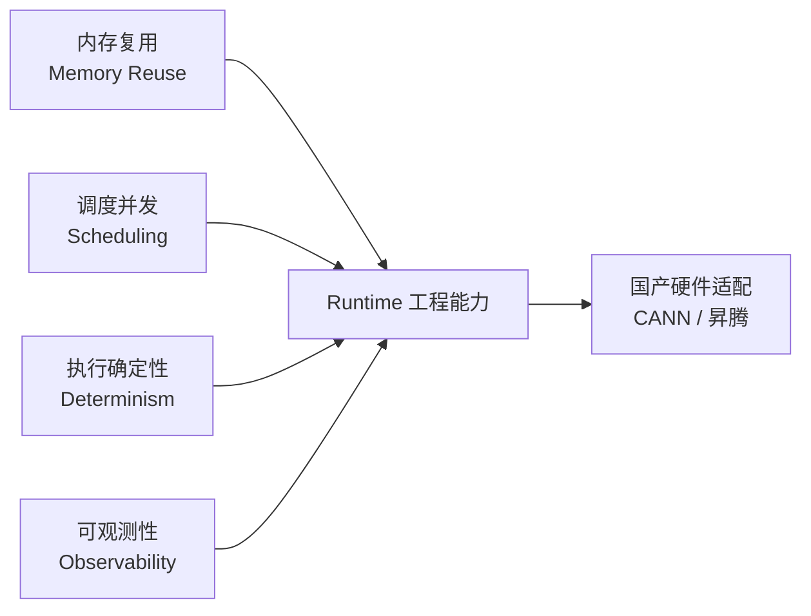
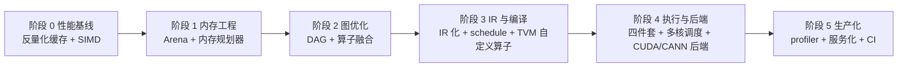

# gguf_cpp · 后续发展路线图

> **从「手写推理引擎」走向「生产级 Runtime」——个人成长 + 项目演进的完整路线**
>
> 本文档是 `README.md` 的**未来篇**：`README.md` 记录「我们已经走到了哪」，本文档回答
> 「下一步往哪走、为什么这么走、以及每一步怎么落地」。主线一句话：
>
> **把 `gguf_cpp` 这个从零手写的推理引擎当作实验田，沿「内存规划 → 图优化 → 编译器 → 异构后端」逐级补齐生产级 Runtime 的工程能力，最终落到国产硬件（昇腾 CANN）这个核心职业方向。**

---

## 📌 目录

- [一、站在哪里：项目现状回顾](#一站在哪里项目现状回顾)
- [二、要去哪：发展定位与一条贯穿主线](#二要去哪发展定位与一条贯穿主线)
- [三、四大学习主线总览](#三四大学习主线总览)
- [四、主线 1：ONNX Runtime —— 生产级 Runtime 的工程实践](#四主线-1onnx-runtime--生产级-runtime-的工程实践)
- [五、主线 2：TVM —— 编译器中台，桥接框架与硬件](#五主线-2tvm--编译器中台桥接框架与硬件)
- [六、主线 3：CANN Runtime —— 国产硬件核心领域](#六主线-3cann-runtime--国产硬件核心领域)
- [七、主线 4：KTransformers —— 异构计算前沿](#七主线-4ktransformers--异构计算前沿)
- [八、项目演进路线图：四个阶段，与主线咬合](#八项目演进路线图四个阶段与主线咬合)
- [九、里程碑与学习节奏（季度规划）](#九里程碑与学习节奏季度规划)
- [十、资源清单](#十资源清单)
- [十一、风险与避坑](#十一风险与避坑)

---

## 一、站在哪里：项目现状回顾

### 1.1 已完成的能力（2026-08 状态）

六阶段链路全部打通，并用真实模型 `Qwen3.5-0.8B`（qwen35 架构，SSM + Attention 混合，24 层，1.5GB）端到端验证：

| 能力 | 状态 | 亮点 |
| :--- | :---: | :--- |
| GGUF 解析（头 / 元数据 / 张量表 / 数据区） | ✅ | 32 字节对齐、递归 ARRAY 解析 |
| 张量数据访问（mmap 零拷贝 / 类型系统 / 反量化） | ✅ | F32/F16/BF16/Q4_0/Q8_0 |
| Tokenizer（byte-level BPE） | ✅ | 特殊 token 整体匹配、字节无损还原 |
| 权重加载（按名索引 / 配置 / 逐层组装） | ✅ | 320 张量零拷贝索引 |
| Transformer 计算（算子 → Attention 层 → SSM 层 → 全模型） | ✅ | GQA + Gated Delta Net |
| 生成引擎（Sampler / 自回归 / Chat） | ✅ | top-k / top-p / 温度 / 多轮对话 |

**质量背书（这是本项目最值钱的部分）**：
- ✅ 与 llama.cpp **逐 token logits 一致**（误差 ≤0.05，浮点精度级）
- ✅ 13 个单元测试全绿，`-Wall -Wextra -Wpedantic` 零警告
- ✅ 复盘并修复了三个隐蔽 bug（解析器对齐、SSM 越界读、Attention Q/gate 交错布局）——这正是「经验」所在
- ✅ 反量化 / 单层 / 全模型与独立 numpy 参考逐值交叉验证

### 1.2 当前瓶颈（决定下一步优先级）

| 瓶颈 | 原因 | 后果 |
| :--- | :--- | :--- |
| ~0.64 tokens/s（单线程 Release） | 每次前向**重新反量化全部权重** + logits 逐元素反量化 embedding（~2.5 亿次） | 吞吐低，但**这个瓶颈本身是绝佳的教学入口** |

> 关键认知：瓶颈不是「算子慢」，而是「**数据布局与内存反复搬运**」——这恰好是 Runtime 层要解决的核心问题，也解释了为什么下一步要从「内存」入手。

### 1.3 与生产级 Runtime 的差距（诚实的差距分析）

> 这一步决定整个路线图的走向。把「教学引擎」和「生产级 Runtime」并排对比：

| 维度 | 教学引擎（现在） | 生产级 Runtime（目标） |
| :--- | :--- | :--- |
| **内存** | 每次前向重新反量化、中间缓冲反复 new/delete | 内存规划器（Arena / BFC）静态规划复用、零碎片 |
| **图** | 硬编码的 24 层 if/else 调用链 | 图表示（DAG）+ 图优化 pass（常量折叠 / 融合 / shape 推断） |
| **调度** | 单线程顺序执行 | 线程池 + 多流 + 任务依赖图 + 确定性调度 |
| **执行模型** | `GGMLForward` 一个巨大函数 | 算子内核 + 后端抽象（EP）+ 图分区 + 内核编译 |
| **可观测性** | 只有 bench 粗略计时 | 逐算子 profiler / FLOPS / 峰值利用率 / trace |
| **正确性保障** | 单测 + llama.cpp 对照 | 差分测试 / golden 回归 / 确定性校验 / CI |
| **硬件** | CPU 单核 | 多核 → GPU(CUDA) → 国产 NPU(CANN) → 异构协同 |

**结论**：我们的项目已经把「**正确的计算**」做完了，缺的正是生产级 Runtime 的「**工程能力**」。而这两者的桥梁是三个主题：**内存规划、图优化、执行调度**——它们正是华为 CANN Runtime 开源时强调的四个词：**内存复用、调度并发、执行确定性、可观测性**。

---

## 二、要去哪：发展定位与一条贯穿主线

### 2.1 发展定位

从「能做对的引擎」升级为「能做得**快、稳、省、可扩展**的引擎」，并以**国产硬件（昇腾 CANN）Runtime 适配**作为长期职业主线。这符合大模型推理的行业趋势：模型规模与系统复杂度上升 → 内存复用、调度并发、执行确定性、可观测性决定系统上限。

### 2.2 一条贯穿主线（牢记这四件事）

所有后续工作都可以归到这四个词下，学习时对照它们，事半功倍：

- **内存复用** → ONNX Runtime 的 Arena/Memory Planner 教你原理；在项目里写一个 Arena 练手
- **调度并发** → TVM 的 schedule 教你在什么粒度并行；在项目里做多核线程池
- **执行确定性** → 输出可复现（seed 确定性）是 Runtime 的底线；在项目里加 golden 回归
- **可观测性** → 逐层 profiler 是定位瓶颈的前提；在项目里写一个

---

## 三、四大学习主线总览

四条主线的**递进逻辑**：先学「别人怎么做生产级 Runtime 的工程」（ORT）→ 再学「编译器如何桥接框架与硬件」（TVM）→ 落到「国产硬件 Runtime」（CANN，职业核心）→ 再看「前沿异构方案的方向感」（KTransformers）。

| 主线 | 主题 | 回答的问题 | 项目落地实验 | 优先级 |
| :-: | :--- | :--- | :--- | :-: |
| 1 | ONNX Runtime | 生产级 Runtime 的内存与图优化怎么设计？ | Arena 内存规划器 + 算子融合 | ★★★★★ 先做 |
| 2 | TVM | 算子如何被表达为 IR 并调度/编译到不同硬件？ | 前向计算 IR 化 + 自定义 codegen | ★★★★ 紧跟 |
| 3 | CANN Runtime | 国产硬件 Runtime 的 Context/Stream/Kernel/Memory 如何实现？ | 后端抽象 + 执行管理四件套 | ★★★★★ 职业核心 |
| 4 | KTransformers | CPU+GPU/NPU 异构协同怎么做系统级创新？ | 异构负载分配实验 / KV 卸载 | ★★★ 视野 |

> **关键提醒（来自你的学习建议）**：底层 Runtime 适配非常吃经验，**动手实践 > 阅读文档**。
> 第一个动手任务就是：**给 ONNX Runtime 或 TVM 添加一个自定义算子 / 内存优化，或给 CANN Runtime 提一个小 PR**。
> 本路线图把「动手」下沉到每一主线里，确保理论学习同步有项目产出。

---

## 四、主线 1：ONNX Runtime —— 生产级 Runtime 的工程实践

> 目的：理解一个生产级推理 Runtime 的**内存规划器**与**图优化**机制。这是你的项目从「教学引擎」升级的教科书。

### 4.1 要学的核心概念

**① 内存规划器（Memory Planner）**
- `IAllocator` 接口 + `ArenaAllocator`（CPU）与 `BFCArena`（GPU，BFC = Best-Fit with Coalescing，源自 TensorFlow）
- 为什么需要 Arena：`cudaMalloc` / `malloc` 每次调用有开销 + 碎片化 → 预分配大块 + 块内复用
- **序列化内存规划（mem pattern）**：`MemPatternTransformer` 在**图级别静态规划**——分析每个中间张量的生命周期，把「不同时存活」的张量映射到同一块 arena 内存，离线算出每个张量的 offset（`MemPattern`），执行时零动态分配
- 这是本项目 `logits`/中间缓冲反复分配问题的**工业级解法**

**② 图优化（Graph Transform）**
- 图 = DAG（节点 = 算子，边 = 张量）。加载 ONNX → 建图 → **shape 推断** → 一串 `GraphTransformer` pass
- 常见 pass：常量折叠（ConstantFolding）、算子融合（如 `GemmActivationFusion`、`FusedMatMul`、`ConvActivationFusion`）、QDQ（量化/反量化）变换、layout 变换
- pass 由 `TransformerRegistry` 注册，按序执行；`TransformerExecutor` 决定在哪个阶段跑哪个 pass
- **本项目对应物**：`RMSNorm→QKV 投影`、`反量化→gemm`、`Q+gate 联合投影` 都是天然可融合点

**③ 执行引擎与 EP（Execution Provider）**
- 图分区（graph partitioning）：`IExecutionProvider::GetCapability` 声明「哪些节点我能跑」，ORT 把图切成多个 subgraph，分派给不同 EP（CPU / CUDA / TensorRT / 昇腾）
- 这是「多后端可插拔」的架构范式，**是将来把 `gguf_cpp` 接到 CANN 的参照物**

### 4.2 在项目里怎么练（落地实验）

| 实验 | 对应 ORT 概念 | 做法 | 验收 |
| :--- | :--- | :--- | :--- |
| E1-1 写一个 Arena 分配器 | `ArenaAllocator` | 新建 `GGMLArena`：预分配一块连续内存 + 空闲块链表（best-fit 分配 / free 合并），替换 `GGMLForward` 里逐层 new/delete 的中间缓冲 | 单测：分配/释放往返、块复用、零碎片断言；bench 内存曲线下降 |
| E1-2 静态内存规划器 | `MemPatternTransformer` | 分析前向 DAG 的中间张量生命周期，离线计算每个 buffer 的 offset，执行时只按 offset 写同一块 arena | 单测：生命周期重叠 → 不同 offset；不重叠 → 复用同一 offset；与朴素版输出逐值一致 |
| E1-3 算子融合 | `GemmActivationFusion` | 把「RMSNorm → QKV 联合投影」和「反量化 → gemm」融合为单个内核（反量化并入 gemm，不做中间 F32 张量） | 输出误差 ≤0.05；bench 提升明显；单测覆盖 |
| E1-4 图 DAG + 简单 pass | `TransformerRegistry` | 把 24 层硬编码调用链改为「建 DAG + 跑 pass（常量折叠 / 融合标记）」 | DAG 语义与硬编码等价；可打印优化前后图（呼应可观测性） |

### 4.3 验收标准

- `GGMLArena` + 内存规划器单测全绿，bench 中间缓冲分配次数归零
- 算子融合后输出与 llama.cpp 仍逐 token 一致（≤0.05）
- **向 ORT 仓库提交一个自定义算子或内存优化 PR**（哪怕 draft）——这是简历上最值钱的一行

---

## 五、主线 2：TVM —— 编译器中台，桥接框架与硬件

> 目的：理解「算子如何被表达为 IR，并通过 schedule + codegen 生成不同硬件上的内核」。这决定了你能不能把同一套模型计算翻译到 CPU / CUDA / NPU 任意后端。

### 5.1 要学的核心概念

- **IR 分层**：Relay/Relax（高层图 IR）→ TIR（底层循环/存储 IR）。高层负责图级优化，低层负责循环变换与代码生成
- **TE（Tensor Expression）+ schedule**：把计算写成纯函数式表达式，通过 `schedule`（split/fuse/reorder/vectorize/parallel）控制「怎么算」，与「算什么」分离——**这是可移植性的根本**
- **AutoTVM / Ansor / MetaSchedule**：自动搜索最优 schedule，替代手写调度
- **代码生成**：`CodeGenLLVM`（CPU）、CUDA/Vulkan（GPU）、以及 **BYOC（Bring Your Own Codegen）**——可以挂自定义后端，这就是接入昇腾/TBE 的接口点
- **target**：`llvm -mcpu=...`、`cuda`、`vulkan`…… target 决定 codegen 与代码生成路径

### 5.2 在项目里怎么练（落地实验）

| 实验 | 对应 TVM 概念 | 做法 | 验收 |
| :--- | :--- | :--- | :--- |
| E2-1 前向计算 IR 化 | Relay/Relax | 把 `GGMLOps`（gemv/gemm/rmsnorm/rope/softmax/delta-net）表达为一个最小的计算图 IR（DAG + 算子枚举 + 形状），`GGMLForward` 改为解释执行 IR | IR 执行与手写路径输出一致；可打印图（profiler 基础） |
| E2-2 最小 schedule 层 | TE/schedule | 给 gemm / 反量化定义可配置调度（并行维度、向量化宽度），把「算法」与「调度」解耦 | 调度参数变化不影响结果，只影响速度；文档化 |
| E2-3 自定义算子进 TVM | 自定义 op / BYOC | 在 TVM 注册一个项目里特有的算子（如 delta-net 状态递推 step），先跑通 relay op 注册 + 自定义 codegen，再与 C++ 参考逐值对照 | TVM 内计算结果与 `GGMLSSM` 一致；这是「给开源加自定义算子」的直接演练 |
| E2-4 接入 ANSOR 学习 | MetaSchedule | 用 AutoTVM/Ansor 对 gemm 自动搜调度，与手写 schedule 对比吞吐 | 对比数据进 bench 文档 |

### 5.3 验收标准

- IR 解释执行通过 golden 对照；schedule 解耦后多参数可配
- **完成一个 TVM 自定义算子**（从注册 → codegen → 正确性对照），跑通端到端
- 能口头讲清「框架 → IR → 优化 → 代码生成 → 硬件」整条链路（面试高频）

---

## 六、主线 3：CANN Runtime —— 国产硬件核心领域

> 目的：**这是你职业发展的核心领域**。CANN Runtime 已走向开源（2025-12），Context、Stream、Kernel、Memory 的真实实现不再是黑盒；社区强调「可以从一个调度策略、一个内存优化、一个可观测性改进开始参与」——门槛低、激励高（社区任务单题最高 7 万+，奖金池 85 万+）。

### 6.1 背景与开源动态（来自你的参考链接）

- CANN Runtime 承担昇腾计算平台中 **执行管理、算力调度、核函数运行、内存管理与系统稳定性** 等关键职责
- 开源意义：① 底层机制透明（不再黑盒）② 可演进的架构（面向多芯片、多形态、分布式）③ 低门槛参与（不需要造轮子）
- 社区主线任务：**调度策略、内存优化、可观测性改进** —— 与本路线图的「贯穿主线」完全一致
- 生态位：Runtime 为更广泛的 AI 软件生态提供通用能力，不只为单一框架服务

### 6.2 要学的核心概念

- **软件栈分层**：AscendCL（应用层 API）→ GE（图引擎）→ **Runtime（执行/调度/内存）** → 算子库（TBE / ACLNN）
- **Runtime 四件套**：`Context`（执行上下文）、`Stream`（任务队列/并发单元）、`Kernel`（核函数启动）、`Memory`（设备内存管理）——理解这四个抽象 = 理解所有硬件 Runtime
- **执行管理**：任务下发、依赖关系、同步/异步
- **内存管理**：HBM 分配、内存池、复用（呼应主线 1 的 Arena）
- **可观测性**：profiling 工具链（如 msprof）、算子耗时归因

### 6.3 在项目里怎么练 + 社区参与

| 实验 | 对应 CANN 概念 | 做法 | 验收 |
| :--- | :--- | :--- | :--- |
| E3-1 后端抽象层 | `IExecutionProvider` / AscendCL | 把 `GGMLOps` 背后抽出一个 `GGMLBackend` 接口（`alloc`/`copy`/`launch`/`sync`），CPU 是第一个实现 | 现有 CPU 路径零行为变化（全单测过），为 CUDA/CANN 后端留好插座 |
| E3-2 实现 Context/Stream/Kernel/Memory 四件套（CPU 版） | CANN Runtime 四件套 | 定义 `Context`（执行配置）、`Stream`（任务队列 + 依赖）、`Kernel`（算子函数句柄）、`Memory`（内存池），把 `GGMLForward` 改成「往 Stream 里提交 Kernel」的执行模型 | 语义等价 + 可打印任务流水（可观测性） |
| E3-3 内存池落地 | CANN Memory | 把主线 1 的 `GGMLArena` 推广为通用 `GGMLMemPool`，验证「内存复用决定系统上限」 | bench 峰值内存下降、零碎片 |
| E3-4 社区参与 | CANN 社区任务 | 注册昇腾社区 → 看 CANN Runtime 开源仓 → 从「内存优化 / 调度 / 可观测性」挑一个任务 → 提 PR | 合入/评审中即算里程碑 |
| E3-5（进阶）真机适配 | AscendCL | 有昇腾环境后，用 `E3-1` 的后端接口写一个 `GGMLBackendAscend`（BF16 反量化 / gemm 用 ACLNN 或 TBE 算子） | 在 Atlas 卡上跑通 `gguf_cpp` 单层前向，与 CPU 对照 |

### 6.4 验收标准

- 后端抽象 + 四件套执行模型跑通，全部单测 + llama.cpp 对照仍绿
- **至少提交一个 CANN 社区/开源仓的 PR**（内存优化或调度策略起步）
- 能讲清 `Context/Stream/Kernel/Memory` 在昇腾栈中的位置与职责

---

## 七、主线 4：KTransformers —— 异构计算前沿

> 目的：建立「异构协同」的系统视野。KTransformers（清华 KVCache.AI + 趋境科技）的**系统级创新**代表了国产硬件适配的未来方向，且已完成昇腾 NPU 全面适配。

### 7.1 它做了什么（值得学的系统级创新）

- **CPU+GPU/NPU 异构协同**：按**计算强度**分配——MoE 模型中计算强度低的路由专家层卸载到 CPU 内存，计算密度最高的注意力层留在 GPU/NPU
- **昇腾适配要点**（你的参考链接）：NUMA 优化（本地内存分配 + 线程调度）、鲲鹏数学库 KML 专项加速、**专家延迟计算**（重叠通信与计算）
- 效果：DeepSeek-R1 671B 在单卡 Atlas 300I A2 上 decode 达 14.9 tokens/s；显存占用降低 90%+
- 生态：与 SGLang 合并分支、与 LLaMA-Factory 集成（LoRA 微调）

### 7.2 学什么 / 在项目里怎么练

| 方向 | 项目实验（简化版） | 验收 |
| :--- | :--- | :--- |
| 计算强度驱动的负载分配 | 给 `gguf_cpp` 加一个「层调度器」：按算子计算强度/访存比把不同层标记为不同后端候选（CPU 核数分派、将来 GPU/NPU） | 可打印每层强度标签与调度决策 |
| 通信-计算重叠 | 预填充阶段把「下一层权重反量化/搬运」与「当前层计算」用流水重叠（参考「专家延迟计算」思想） | bench 前向耗时下降 |
| KV 缓存卸载 | 学习 KV cache 分页/卸载思想，在项目里做 KV/SSM 状态的分段持久化（`state.bin`） | 长对话内存可控 |
| MoE 理解（准备） | 通读 KTransformers 的 MoE 专家路由 + CPU 稀疏内核思路，为将来支持 MoE 架构模型打底 | 能讲清「GPU 主干 + CPU 专家」分工 |

### 7.3 验收标准

- 完成「层调度器」与「通信-计算重叠」两个简化实验并出 bench 数据
- 能复述 KTransformers 在昇腾上做适配的四个系统级优化点（异构分工 / NUMA / KML / 延迟计算）

---

## 八、项目演进路线图：四个阶段，与主线咬合

> 与 README 的 ⑦—⑩ 阶段衔接，但**按 Runtime 能力重新编排**，每阶段绑定一条主线，避免「什么都做」。

| 阶段 | 主题 | 核心工作 | 绑定主线 | 里程碑 |
| :-: | :--- | :--- | :--- | :--- |
| **P0** | 性能基线（先做） | 权重反量化缓存、logits 批量反量化 + SIMD、KV/SSM 增量复用 | 贯穿主线：可观测性 | 吞吐提升一个量级；`bench` 建基线 |
| **P1** | 内存工程 | `GGMLArena` + 静态内存规划器（E1-1/E1-2） | ORT 内存规划器 | 中间缓冲零动态分配；峰值内存下降 |
| **P2** | 图优化 | 前向 DAG 化 + 常量折叠 + 算子融合（E1-3/E1-4） | ORT 图优化 | 融合后与 llama.cpp 仍逐 token 一致 |
| **P3** | IR 与编译 | 计算 IR + schedule 解耦 + TVM 自定义算子（E2-1~E2-4） | TVM | 同一套 IR 可调度到 CPU/GPU 概念验证 |
| **P4** | 执行与后端 | 后端抽象 + Context/Stream/Kernel/Memory + 多核线程池 + CUDA 后端（E3-1~E3-3） | CANN Runtime | CPU 零行为变化；CUDA 可选后端跑通；为 CANN 留接口 |
| **P5** | 生产化 | profiler/FLOPS、golden 差分测试、CI + 覆盖率、OpenAI 兼容服务 | 贯穿主线 | 可服务、可回归、可观测 |

> 阶段顺序的**理由**：P0 建立基线（不优化就无法证明后续有效）；P1 直击当前最大瓶颈（内存反复搬运）；P2/P3 是 Runtime 的骨架（图 + 编译）；P4 落到底层硬件（职业核心）；P5 收口工程化。每一步都在「README 工作流」里验收：独立分支 → 单测 → 与 llama.cpp/numpy 交叉验证 → 更新状态标记。

---

## 九、里程碑与学习节奏（季度规划）

> 按「收益 / 成本」排序，目标是每个季度都有一个**可写进简历**的产出。

### 里程碑总表

| 里程碑 | 时间 | 完成标志 | 可写入简历的表述 |
| :--- | :--- | :--- | :--- |
| **M1 · 高效引擎** | 第 1 季度 | SIMD + 反量化缓存 + 多核，吞吐提升 ≥10× | 实现量化矩阵乘、SIMD 与多线程并行，吞吐提升 X 倍 |
| **M2 · 内存与图工程** | 第 2 季度 | Arena 内存规划器 + 算子融合，与 llama.cpp 仍逐 token 一致 | 实现类 ORT 的内存规划器与图优化 pass，消除中间缓冲动态分配 |
| **M3 · 编译器能力** | 第 3 季度 | 前向 IR 化 + **提交 TVM 自定义算子** | 为 TVM 提交自定义算子，打通框架→IR→codegen 链路 |
| **M4 · Runtime 核心** | 第 4 季度 | 后端抽象 + 四件套执行模型 + **CANN 社区 PR** | 实现可插拔后端抽象与执行管理模型；向 CANN Runtime 提交内存优化 PR |
| **M5 · 可服务引擎** | 第 5 季度 | CUDA（可选）+ OpenAI 兼容 HTTP + CI | 支持 GPU/CPU 双后端与 OpenAI 兼容服务 |
| **M6 · 国产硬件落地** | 第 6 季度 | （有硬件时）CANN 后端真机跑通 | 完成昇腾 NPU 上的模型前向适配，与 CPU 结果一致 |

### 每周节奏建议

1. **2 天理论**：读对应主线章节 + 源码（ORT mem_pattern / arena；TVM schedule；CANN 文档）
2. **3 天动手**：实现对应的 E 系列实验 + 单测 + bench
3. **1 天对照**：与 llama.cpp / numpy 交叉验证，更新 README/FUTURE 状态
4. **1 天沉淀**：写笔记/博客，整理可写简历的量化数据

---

## 十、资源清单

**ONNX Runtime**
- 源码：`onnxruntime/core/framework/mem_pattern.h`、`arena_allocator.*`、`bfc_arena.*`、`MemPatternTransformer`、`onnxruntime/core/optimizer/`、`IExecutionProvider::GetCapability`

**TVM**
- 官网教程（TE/schedule、AutoTVM、Ansor/MetaSchedule、BYOC codegen）、Relax IR 文档
- 实操入口：给 `tvm` 注册自定义 relay op + 自定义 codegen

**CANN / 昇腾**
- 昇腾社区：`hiascend.com`（动态新闻、社区任务）；CANN 文档（AscendCL / GE / Runtime 编程模型）
- 你的参考：华为云社区《CANN Runtime，走向开源》（Runtime 四件事 + 低门槛参与方式）
- 社区任务：CANN 社区任务上新（内存优化 / 调度 / 可观测性起步）

**KTransformers**
- `github.com/kvcache-ai/ktransformers`（含昇腾 NPU 部署教程：`doc/zh/DeepseekR1_tutorial_zh_for_Ascend_NPU.md`）
- 你的参考：科技日报《KTransformers 打造全国产大模型方案》、昇腾《KTransformers 新增支持昇腾 NPU 开源适配》

**项目内已有工具（继续复用）**
- `temp/gguf_logits.cpp` + `temp/llama_logits.cpp`：逐 token logits A/B 对照
- `tools/ref_full.py`：numpy 参考实现
- `src/bench/bench.cpp`：性能基线
- `tools/`：NaN 扫描 / offset 对比

---

## 十一、风险与避坑

1. **不要为了「多」而做**：四主线是「先后关系」不是「同时进行」。没有 P0 基线就谈优化 = 自欺欺人。
2. **正确性 > 性能**：每个优化后先过「与 llama.cpp 逐 token 一致」这一关，再谈快了 10 倍。沿用 ≤0.05 浮点阈值。
3. **硬件依赖要解耦**：CUDA/CANN 全部走 `GGMLBackend` 接口 + 编译开关，默认 OFF 保持零依赖纯 CPU 可回退（延续现有哲学）。
4. **浮点累加顺序差异**：换并行/换后端后与 CPU 存在浮点级差异，对照阈值沿用现有标准，不要误判为 bug。
5. **CANN 贡献先小后大**：第一个 PR 从「内存优化 / 调度 / 可观测性」的小任务开始，先熟悉社区流程（含 CLA/许可），不要一上来啃大模块。
6. **版本敏感**：TVM / ORT / CANN 版本迭代快，笔记里记录版本号；跑不通时先查版本匹配。
7. **保留「教学可读性」**：优化永远以「模块追加 + 注释解释为什么」的方式做，别把 `gguf_cpp` 变成看不懂的产物——它是你面试时最好的**讲故事的素材**。

---

*本文档随项目演进持续更新，每个里程碑完成时回填实际数据与链接。主线执行情况与 README 的 ✅/🔄/⬜ 状态保持一致。*
