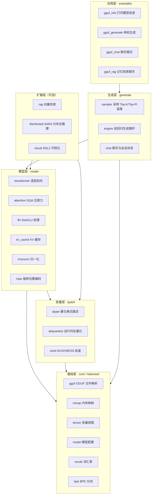
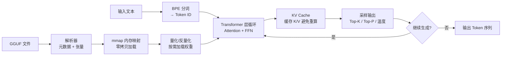

# gguf_parser — 极简 GGUF 推理引擎 · 项目架构

> 设计目标：在标准 GGUF 格式下直接运行 LLaMA / Qwen 等模型的**微型推理引擎**。
> 核心代码保持在"一眼能看完"的范围内，零外部依赖（纯 C++20 + 标准库）。

参考：*读懂大模型：一个极简 GGUF 推理引擎的设计与实现*。

---

## 一、设计哲学（来自文章的"做减法"）

| 原则 | 落地方式 |
|---|---|
| **零依赖** | 只用 C++ 标准库 + 操作系统调用（`mmap`），无需 Python / PyTorch / CUDA |
| **直接加载** | `mmap` 映射 GGUF 文件，零拷贝、按需分页，不做格式转换 |
| **可读性优先** | 每个模块小而聚焦，公共接口 + 简短实现；注释解释"为什么"而非"是什么" |
| **按需扩展** | 新功能以模块方式追加（RAG / 分布式 / 可视化），不侵入核心路径 |
| **嵌入式友好** | 内存占用受控（KV Cache 复用、运行时反量化），可在受限设备运行 |

---

## 二、总体分层架构

依赖方向：**上层依赖下层，下层不感知上层**。



---

## 三、推理主流程（对应文章 8 步）



| 步骤 | 模块 | 说明 |
|---|---|---|
| 1 | `core::gguf` | 解析 GGUF 头部、元数据（配置/词汇表）、张量信息表 |
| 2 | `core::mmap` | 把文件映射进内存，零拷贝、多进程可共享、按需分页 |
| 3 | `tokenizer::bpe` | 标准 Byte Pair Encoding，文本 ↔ Token ID |
| 4 | `quant::dequantize` | Q8_0 / Q4_K / Q1_0 等格式按需反量化为 FP32 |
| 5 | `model::transformer` | 每层 11 步：RMSNorm → QKV → RoPE → KV Cache → GQA 注意力 → 输出投影 → 残差 → RMSNorm → SwiGLU FFN → 残差 |
| 6 | `model::kv_cache` | 缓存已生成 Token 的 K/V，自回归关键优化 |
| 7 | `generate::sampler` | Greedy / Top-K / Top-P / 温度采样下一个 Token |
| 8 | `generate::engine` | 自回归循环，把输出喂回输入直到停止条件 |

---

## 四、目录结构

```
gguf_parser/
├── CMakeLists.txt                # 顶层构建配置
├── CMakePresets.json             # CMake 预设
├── cmake/
│   └── CompileWarnings.cmake     # 编译警告配置
├── include/gguf_parser/          # 库公共头文件（按模块分层）
│   ├── core/                     # 基础层：文件格式与加载
│   │   ├── gguf.hpp              #   GGUF 格式结构 + 解析接口
│   │   ├── mmap.hpp              #   mmap 内存映射 RAII
│   │   ├── tensor.hpp            #   张量视图（名称/形状/类型/数据）
│   │   └── model.hpp             #   加载后的模型配置
│   ├── tokenizer/                # 基础层：分词
│   │   ├── vocab.hpp             #   词汇表（token → id / id → token）
│   │   └── bpe.hpp               #   BPE 分词器
│   ├── quant/                    # 张量层：量化
│   │   ├── qtype.hpp             #   量化格式枚举与元信息
│   │   ├── dequantize.hpp        #   运行时反量化
│   │   └── simd.hpp              #   SIMD 热路径（AVX2/NEON）
│   ├── model/                    # 模型层：Transformer
│   │   ├── rmsnorm.hpp
│   │   ├── rope.hpp
│   │   ├── attention.hpp         #   GQA 分组查询注意力
│   │   ├── kv_cache.hpp
│   │   ├── ffn.hpp               #   SwiGLU 前馈网络
│   │   └── transformer.hpp       #   逐层前向编排
│   ├── generate/                 # 生成层
│   │   ├── sampler.hpp           #   Top-K/Top-P/温度
│   │   ├── engine.hpp            #   自回归生成引擎
│   │   └── chat.hpp              #   聊天模式 + 状态保存/加载
│   ├── rag/                      # 扩展层：检索增强（可选）
│   │   ├── embedding.hpp
│   │   └── retriever.hpp
│   ├── distributed/              # 扩展层：SARA 分布式（可选）
│   │   └── sara.hpp
│   └── math_utils.hpp            # 保留：原有示例工具
├── src/                          # 库实现（与 include 一一对应）
│   ├── core/
│   ├── tokenizer/
│   ├── quant/
│   ├── model/
│   ├── generate/
│   ├── rag/
│   └── distributed/
├── examples/                     # 应用层示例
│   ├── hello.cpp                 # 保留：原示例
│   ├── gguf_info.cpp             #   打印模型信息
│   ├── gguf_generate.cpp         #   单轮生成（对应 gguf-fast -p）
│   ├── gguf_chat.cpp             #   聊天模式（对应 gguf-fast -C）
│   └── gguf_rag.cpp              #   带记忆检索的聊天（对应 -B bert.gguf）
├── tests/                        # GoogleTest 单元测试
│   ├── test_math_utils.cpp       # 保留
│   ├── test_gguf.cpp
│   ├── test_bpe.cpp
│   ├── test_quant.cpp
│   ├── test_sampler.cpp
│   └── test_kv_cache.cpp
└── doc/
    └── architecture.md           # 本文档
```

---

## 五、模块职责与依赖方向

| 目录 | 职责 | 依赖 | 对应文章章节 |
|---|---|---|---|
| `core` | GGUF 解析、mmap、张量、模型配置 | 无（仅标准库） | §3.2 步骤 1–2 |
| `tokenizer` | 词汇表 + BPE | `core` | §3.2 步骤 3 |
| `quant` | 量化元信息 + 反量化 + SIMD | `core` | §5 量化与内存优化 |
| `model` | Transformer 11 步前向 | `quant`, `core` | §4 Transformer 单层 |
| `generate` | 采样 + 自回归 + 聊天状态 | `model`, `tokenizer` | §3.2 步骤 7–8、§8 聊天 |
| `rag` | BERT 嵌入 + 内存向量库 | `model`, `tokenizer` | §6 RAG 检索 |
| `distributed` | SARA 模型分片 | `model`, `quant` | §7 分布式推理 |

**核心不变量**：`model` 层是纯计算（无 IO、无文本），`generate` 层负责编排与状态，
`core` 层只负责"把文件变成内存里的张量"。这样每一层都能独立测试。

---

## 六、关键设计决策

1. **零拷贝加载**：`mmap` 映射文件后，张量数据指针直接指向映射区，不复制权重；
   配合操作系统按需分页，7B 模型 + 4K 上下文在 Q8_0 下约 512MB 内存。
2. **运行时反量化**：不在加载时一次性反量化所有权重（内存会爆炸），而是计算到某一层时
   临时反量化该层权重，算完即弃（`dequantize::dequantize_tensor`）。
3. **热路径 SIMD**：只对矩阵乘法等高频算子做 AVX2/NEON 加速（`simd.hpp`），
   其余代码保持可读。
4. **KV Cache 复用**：`kv_cache` 以环形缓冲区管理，预分配最大上下文长度的 K/V 空间。
5. **状态可持久化**：聊天状态（KV Cache + 生成位置）可序列化为 `state.bin`，
   支持"预填系统提示 → 保存 → 下次秒级恢复"。
6. **模块即选项**：RAG、分布式、可视化均为可选扩展，不参与默认构建，保持核心简洁。

---

## 七、构建与运行

```bash
# 配置并构建 Debug
cmake --preset debug
cmake --build --preset debug

# 运行单元测试
ctest --preset debug

# 打印 GGUF 模型信息
./build/debug/bin/gguf_info model.gguf

# 单轮生成 64 token（对应文章 gguf-fast）
./build/debug/bin/gguf_generate -m model.gguf -n 64 -p "Hello there"

# 聊天模式
./build/debug/bin/gguf_chat -m model.gguf -C -A Assistant -U User -E "User:" -n 256

# RAG 检索聊天
./build/debug/bin/gguf_rag -m model.gguf -C -l chat.log -B bert.gguf -n 256
```

> 模型可从 Hugging Face 下载，如 `TheBloke/Mistral-7B-Instruct-v0.3-GGUF`。

---

## 八、实现状态与路线图

| 模块 | 状态 | 说明 |
|---|---|---|
| `core`（gguf/mmap/tensor/model） | 骨架 | 接口已定，GGUF 二进制解析待完善 |
| `tokenizer`（vocab/bpe） | 骨架 | BPE 合并规则实现中 |
| `quant`（qtype/dequantize/simd） | 骨架 | Q8_0 反量化优先，Q4_K/Q1_0 后续 |
| `model`（transformer 等） | 骨架 | 前向数据流已搭好，算子逐个实现 |
| `generate`（sampler/engine/chat） | 骨架 | 采样器已实现，引擎编排待接模型 |
| `rag` / `distributed` | 占位 | 预留接口，按需扩展 |

推进顺序（保持"每次都能编译、都能跑"）：
1. GGUF 解析 + mmap → 能打印模型信息（`gguf_info`）
2. BPE 分词 → 文本↔Token 双向
3. Q8_0 反量化 + 张量乘法
4. Transformer 层前向 + KV Cache
5. 采样 + 自回归 → 能生成文本
6. 聊天状态 + RAG + 分布式（可选）
