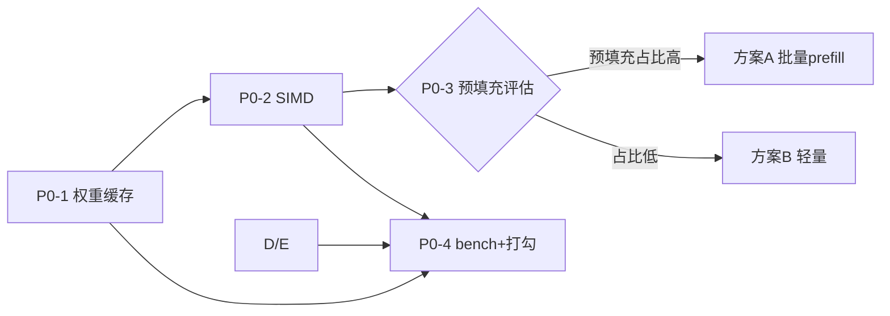

# P0 性能基线 · 设计文档

> **状态：设计定稿（2026-08-31）。仅设计，不包含实现。**
>
> 本文档是 `FUTURE.md` 路线图中 **P0 阶段（性能基线）** 的详细设计蓝图，
> 也是后续「逐流程执行 + 完成打勾」的依据。执行时按本文档第 2 节闭环逐个推进，
> 每个子流程完成后更新 `README.md`（阶段⑦）与 `FUTURE.md`（P0 里程碑）的状态。

---

## 📌 目录

- [1. 概述](#1-概述)
- [2. 执行规范（每个流程的闭环）](#2-执行规范每个流程的闭环)
- [3. 基线现状（代码状态）](#3-基线现状代码状态)
- [4. P0-1 权重反量化缓存](#4-p0-1-权重反量化缓存)
- [5. P0-2 SIMD 向量化](#5-p0-2-simd-向量化)
- [6. P0-3 KV/SSM 状态增量复用](#6-p0-3-kvssm-状态增量复用)
- [7. P0-4 bench 改造与文档打勾](#7-p0-4-bench-改造与文档打勾)
- [8. 执行顺序与依赖](#8-执行顺序与依赖)
- [9. 验收总标准与回滚](#9-验收总标准与回滚)
- [10. 风险清单](#10-风险清单)

---

## 1. 概述

### 1.1 目的

当前全模型前向吞吐约 **0.64 tokens/s**（单线程 Release）。瓶颈不是「算子慢」，而是：

1. **每次前向重新反量化全部权重**（18 个 SSM 层 + 6 个 Attention 层，BF16→float）
2. **logits 逐元素反量化 embedding**：`vocab × hidden ≈ 2.5 亿次`
3. 中间缓冲逐层 `new/delete`

P0 的目标是**建立一条可信的性能基线**，把吞吐提升一个量级，并顺带完成「内存复用 / 可观测性」这两条贯穿主线的第一步实践。它是 P1（内存工程）之后所有优化阶段的**测量基准**——没有它，后续任何优化都无法证明有效。

### 1.2 范围

| 子流程 | 主题 | 状态 |
| :-: | :--- | :-: |
| P0-1 | 权重反量化缓存 | ⬜ 设计定稿，待实现 |
| P0-2 | logits 批量反量化 + SIMD | ⬜ 设计定稿，待实现 |
| P0-3 | KV/SSM 状态增量复用（预填充优化） | ⬜ 设计定稿，**数据驱动决策** |
| P0-4 | bench 改造与文档打勾 | ⬜ 设计定稿，收口 |

### 1.3 设计原则（所有子流程通用）

- **模块追加**：新能力以独立文件/模块追加，不侵入现有核心路径
- **零依赖**：纯 C++20 + 标准库；SIMD 用编译器内建（`<immintrin.h>` / ARM NEON），不引第三方
- **向后兼容**：所有新增接口带**默认参数**，现有调用点零改动（现有 13 个单测不改）
- **正确性 > 性能**：每个子流程先过「与 llama.cpp 逐 token 一致（≤0.05）」再谈速度
- **可回滚**：每个子流程独立提交，出问题可单独 revert
- **可观测性优先**：每一步都产出可对比的 bench 数据，杜绝"感觉快了"

---

## 2. 执行规范（每个流程的闭环）

每个子流程按以下固定闭环执行，**完成 = 六步全部走完**，才在文档打勾：

**细则**：
- 独立分支改动，`master` 始终可构建可跑
- 每个优化先过「与 llama.cpp 逐 token 一致」这一关，再谈速度
- 每次改动跑 `ctest` 全绿 + `bench` 记录基线
- 打勾口径：README 阶段⑦ 勾选对应条目 + FUTURE P0 里程碑回填实测数据

---

## 3. 基线现状（代码状态）

> **注意：截至本设计定稿，之前尝试的 P0-1 代码改动已被全部撤销，工作区回到初始状态。**

当前基线（与本文档设计对齐的入口）：
- `GGMLForward`（`src/model/GGMLForward.cpp`）：全模型前向，每次前向重新反量化全部权重；logits 逐元素 `GGMLDequantizeOne`
- `GGMLTransformerAttentionBlock`（`src/model/GGMLTransformer.cpp`）：内部 `load_tensor()` 每次调用 `read_all` 反量化本层权重
- `GGMLSSMLayer`（`src/model/GGMLSSM.cpp`）：同上
- `GGUFModelWeights`：`build()` 建立 `views_` 索引，`find()` 按名取张量；**尚无遍历全部张量的公开接口**
- `GGMLGenerate` / `GGMLChat`：逐 token 调 `GGMLForward`，无缓存概念
- `src/test/`：13 个单测全绿（解析 / 类型 / 反量化 / 分词 / 权重 / 算子 / 层前向 / SSM / 全模型 / 采样 / 生成 / Chat / 真实分词）

**基线数据（README 记录，Release 单线程）**：
- 全模型前向 1.56 s/token ≈ 0.64 tokens/s
- 单层 SSM 前向（含反量化）47.0 ms；单层 Attention 39.2 ms
- 常驻内存 VmRSS 1688 MB

> 所有 P0 子流程的「提升幅度」都以第 3 节基线为分母计算。

---

## 4. P0-1 权重反量化缓存

### 4.1 问题定位

- 每次前向重新反量化全部权重：18 SSM 层 + 6 Attention 层 + `token_embd` + `output_norm`
- logits 逐元素反量化 embedding：`vocab × hidden ≈ 2.5 亿次`（最大单点瓶颈）
- 反量化是**确定性纯函数** → 结果可安全缓存复用

### 4.2 设计

**数据结构 `GGMLWeightCache`**（`include/model/GGMLWeightCache.hpp` + `src/model/GGMLWeightCache.cpp`）：
- 存储：`std::unordered_map<const GGUFTensorView*, std::vector<float>>`
- `get(v)`：**惰性**——首访反量化并缓存，之后返回同一份 float 数组的引用；`nullptr` / 不支持类型返回空（不缓存）
- `prewarm(w)`：遍历模型全部张量预反量化（加载阶段热身；bench 计时前调用）
- 观测：`size()`（缓存张量数）、`bytes()`（占用 MB）→ 呼应「可观测性」主线
- `clear()`：清空释放 float 内存

**接口扩展（向后兼容的核心设计）**：
- `GGMLTransformerAttentionBlock` / `GGMLSSMLayer` / `GGMLForward` / `GGMLGenerate`
  各增加末尾可选参数 `const GGMLWeightCache *wc = nullptr`
- `wc == nullptr` 时，函数内部构造**一次性局部缓存** → 行为与现状「每次反量化」完全一致（现有单测零改动的原因）
- `wc != nullptr` 时，跨前向复用 → 消除重复反量化
- 实现方式：函数体首行 `GGMLWeightCache local; const GGMLWeightCache &W = wc ? *wc : local;`，所有权重改为 `W.get(...)`（返回 const 引用，零拷贝）

**顺带收益**：`token_embd` 缓存为 float 后，logits 投影从「逐元素反量化 + 点积」降为「纯点积」→ 为 P0-2 的 SIMD 铺好前提。

**调用链**：`chat` / `bench` / `main` 持有缓存 → 传入 `GGMLGenerate` → 透传 `GGMLForward` → 透传各层。`GGMLChat` 内部持有一份缓存，`init()` 时 `prewarm`。

### 4.3 改动文件清单

| 文件 | 动作 | 说明 |
| :--- | :--- | :--- |
| `include/model/GGMLWeightCache.hpp` | 新增 | 缓存类声明 |
| `src/model/GGMLWeightCache.cpp` | 新增 | 缓存实现 |
| `include/core/GGUFModelWeights.hpp` / `src/core/GGUFModelWeights.cpp` | 修改 | 新增 `all_tensors()` 供 prewarm 遍历 |
| `include/model/GGMLTransformer.hpp` / `src/model/GGMLTransformer.cpp` | 修改 | 加 `wc` 参数，权重改 `W.get` |
| `include/model/GGMLSSM.hpp` / `src/model/GGMLSSM.cpp` | 修改 | 同上 |
| `include/model/GGMLForward.hpp` / `src/model/GGMLForward.cpp` | 修改 | 加 `wc` 参数；embedding/logits 从缓存取 |
| `include/model/GGMLGenerate.hpp` / `src/model/GGMLGenerate.cpp` | 修改 | 加 `wc` 透传 |
| `include/model/GGMLChat.hpp` / `src/model/GGMLChat.cpp` | 修改 | 成员缓存 + init 预热 + 透传 |
| `src/model/CMakeLists.txt` | 修改 | 注册 `GGMLWeightCache.cpp` |
| `src/test/CMakeLists.txt` | 修改 | 注册 `test_weight_cache` |
| `src/bench/bench.cpp` | 修改 | 接入缓存 + 无缓存/有缓存对比 |
| `src/main.cpp`、`src/chat_main.cpp` | 修改 | 接入缓存 |
| `src/test/test_weight_cache.cpp` | 新增 | 单元测试 |

### 4.4 测试设计（`test_weight_cache` 断言清单）

复用 `test_forward` 的假模型构造（2 层：SSM + Attention，F32 数据区），断言：

1. **结果一致**：`GGMLForward(..., &wc)` 与 `GGMLForward(...)` 的 logits **逐值相等**（反量化确定性）
2. **惰性生效**：prewarm 前 `size()==0` → 一次前向后 `size()>0`
3. **prewarm 全覆盖**：`prewarm` 后 `size() == weights.count()`
4. **nullptr 安全**：`get(nullptr)` 返回空数组、不缓存
5. **复用正确**：同一缓存连续两次前向，第二次结果与第一次一致

### 4.5 验收与预期

- `ctest` 全绿（原 13 + 新增 1）
- `bench`：全模型前向吞吐较 ~0.64 tok/s 提升（**预计 ≥3×，以实测为准**）
- 与 llama.cpp 逐 token logits 仍一致（≤0.05）
- 内存代价：~1.5GB(BF16) → ~3GB(float)，与 README 预估一致，可接受

### 4.6 风险与回滚

- 风险：RSS 翻倍（已评估可接受）；首次前向含反量化耗时（用 `prewarm` 提前到加载阶段解决）
- 回滚：revert 该提交即回到原「每次反量化」路径，所有单测仍绿

---

## 5. P0-2 SIMD 向量化

### 5.1 目标

P0-1 后热点变为**纯浮点点积**（gemv / logits 投影 / FFN 投影 / 反量化热路径），用 SIMD 榨干单核吞吐。

### 5.2 设计：`GGMLSimd.hpp`

- 提供原子操作：`dot(x, y, n)`、`fma_add`、`scale` 等
- **三实现 + 编译期选择**：AVX2（`__AVX2__` + FMA）/ NEON（`__ARM_NEON`）/ 标量 fallback
- 运行时检测（可选）：x86 用 `__builtin_cpu_supports("avx2")` 动态分派；先做编译期，动态分派留后续
- CMake：可选 `-mavx2 -mfma` 编译选项，默认开启、可关（`GGML_NO_SIMD` 回退标量）

### 5.3 接入点（热点清单）

1. `GGMLOps::GGMLGemmVec`（gemv，逐行点积）——最高频
2. logits 投影（`GGMLForward` 第 4 步，P0-1 后已是纯点积）
3. 反量化热路径（BF16→float 批量、Q4_0 / Q8_0 解包）向量化

### 5.4 测试

- 断言「SIMD 路径与标量路径**逐位一致**」（同一输入，两套实现对比）
- 保留 `GGML_NO_SIMD` 回退开关验证标量路径仍可用

### 5.5 验收

- `ctest` 全绿；bench 吞吐较 P0-1 再提升（期望点积部分 2~4×，以实测为准）
- 与 llama.cpp 仍逐 token 一致（≤0.05）

---

## 6. P0-3 KV/SSM 状态增量复用

### 6.1 现状

预填充按「逐 token 串行前向」实现（正确但慢）。SSM/Attention 状态本就逐 token 增量更新，无重复计算，因此本步**不是**消除重复计算，而是降低预填充的**调度与分配开销**。

### 6.2 两个候选方案（决策点，数据驱动）

| | 方案 A：批量 prefill 重构 | 方案 B：轻量增量 |
| :--- | :--- | :--- |
| 内容 | `GGMLForward` 增加批量入口：embedding 批量读入、层内投影按 `[seq,hidden]×W` | 仅批量读 embedding + 复用中间缓冲 + 减少逐 token 分配 |
| 收益 | 预填充吞吐量级提升 | 中 |
| 成本/风险 | 大重构，触及层函数核心，可能引入数值/状态错误 | 小、低风险 |
| 建议 | 保留为远期 | **P0-2 实测后先做** |

### 6.3 决策规则

在 P0-2 完成后，用真实模型测量「预填充 vs decode」耗时占比：
- 预填充占比显著 → 实施方案 A（批量 prefill）
- 占比低 → 先做方案 B（轻量），方案 A 列入远期

> 本步刻意**留白**，避免过度设计：先有数据，再决定投入。

### 6.4 验收

- 与逐 token 前向结果**逐值一致**（纯优化，不改数值语义）
- `ctest` 全绿；bench 预填充阶段耗时下降（对比数据回填）

---

## 7. P0-4 bench 改造与文档打勾

### 7.1 `bench.cpp` 输出设计

并排对比（可观测性落地）：
- 全模型前向 **每次反量化**（基线）
- 全模型前向 **权重已缓存**（P0-1/2 结果）
- 附加：缓存占用（MB）、`VmRSS`、单层 SSM/Attention（含反量化 vs 缓存）对比

### 7.2 打勾范围

- `README.md` 阶段⑦：勾选「权重反量化缓存」「logits 批量反量化 + SIMD」「KV/SSM 增量复用」；更新性能测试表为实测数据
- `FUTURE.md`：P0 里程碑回填实际吞吐与内存数据，并把 P0 标为 ✅

---

## 8. 执行顺序与依赖

- **P0-1 → P0-2 严格串行**：P0-2 依赖 P0-1 的「纯点积」前提
- **P0-3 是可选项**，由 P0-2 后的实测数据驱动
- **P0-4 收口**：所有实测数据回填 + 文档打勾，P0 阶段正式完成

---

## 9. 验收总标准与回滚

### 9.1 总验收

| 项 | 标准 |
| :--- | :--- |
| 正确性 | `ctest` 全绿；与 llama.cpp 逐 token logits 一致（≤0.05） |
| 性能 | `bench` 吞吐较基线 0.64 tok/s 提升一个量级（≥10×，P0-1+2 合计） |
| 兼容 | 现有调用点与 13 个单测零改动；`GGML_NO_SIMD` 可回退标量 |
| 文档 | README 阶段⑦ + FUTURE P0 状态打勾，实测数据回填 |

### 9.2 回滚策略

- 每个子流程独立提交；`git revert` 该提交即可回到上一可用状态
- 关键保障：任何子流程合入前，`master` 都保持可构建 + 单测全绿 + 与 llama.cpp 一致

---

## 10. 风险清单

| # | 风险 | 影响 | 缓解 |
| :-: | :--- | :--- | :--- |
| 1 | 内存翻倍（float 缓存） | RSS ~1.5GB → ~3GB | 已评估可接受；可后续用「只缓存热权重」+ 分块缓存优化 |
| 2 | SIMD 浮点累加顺序不同 | 与标量存在末位差异 | 单测用「逐位一致」校验仅在纯转发时要求；跨实现对照用 ≤0.05 阈值 |
| 3 | 预填充重构引入状态错误 | 数值发散 | 方案 A 必须逐 token 对照；先做低风险方案 B |
| 4 | 编译器无 AVX2 | 编译失败/回退 | `GGML_NO_SIMD` 开关 + 编译期特性检测 |
| 5 | 版本/工具链差异 | 行为不一致 | 记录编译器与 CPU 特性到 bench 输出 |
| 6 | 「感觉快了」无数据 | 无法证明优化 | 所有结论以 bench 前后对比为准（P0-4 强制） |

---

*本文档随 P0 执行持续更新：每个子流程完成后回填实测数据，并把状态从 ⬜ 改为 ✅。*
