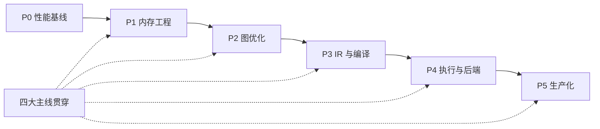

# 全阶段设计蓝图（Roadmap Design）

> **状态：设计定稿（2026-08-31）。仅设计，不包含实现。**
>
> 本文档把 `FUTURE.md` 路线图中的**全部后续需求**整理为可执行的设计条目，
> 与专项设计文档配合使用：
> - **P0（性能基线）** 的详细设计见 [`p0-design.md`](p0-design.md)
> - 本文档覆盖 **P1–P5 全部阶段 + 四大学习主线的项目落地需求 + 里程碑**
>
> 执行方式与 `p0-design.md` 第 2 节一致：每个需求按「设计→实现→单测→
> 交叉验证→bench→文档打勾」六步闭环推进，每完成一个在本文档与 README/FUTURE 打勾。

---

## 📌 目录

- [✅ 执行追踪清单（逐条打勾）](#-执行追踪清单逐条打勾)
- [1. 需求总览](#1-需求总览)
- [2. P1 内存工程（Arena + 内存规划器）](#2-p1-内存工程)
- [3. P2 图优化（DAG + 算子融合）](#3-p2-图优化)
- [4. P3 IR 与编译（TVM 学习落地）](#4-p3-ir-与编译)
- [5. P4 执行与后端（CANN 四件套 + 多核 + CUDA）](#5-p4-执行与后端)
- [6. P5 生产化（profiler + 差分测试 + CI + 服务化）](#6-p5-生产化)
- [7. 四大学习主线 → 项目落地需求映射](#7-四大学习主线--项目落地需求映射)
- [8. 里程碑与验收（M1–M6）](#8-里程碑与验收)
- [9. 全局验收与依赖](#9-全局验收与依赖)
- [10. 风险与避坑（全阶段）](#10-风险与避坑)

---

## ✅ 执行追踪清单（逐条打勾）

> 完成一个需求 → 在此勾选 `[x]`，并同步更新 `README.md` / `FUTURE.md` 状态。

**P0 · 性能基线**（详细设计见 [`p0-design.md`](p0-design.md)）
- [ ] P0-1 权重反量化缓存（每次前向复用 float 权重）
- [ ] P0-2 logits 批量反量化 + SIMD
- [ ] P0-3 KV/SSM 状态增量复用（预填充优化）
- [ ] P0-4 bench 基线对比 + 更新文档打勾

**P1 · 内存工程**
- [ ] P1-R1 `GGMLArena` 分配器（best-fit + free 合并）
- [ ] P1-R2 静态内存规划器（生命周期 → offset 复用）
- [ ] P1-R3 `GGMLMemPool` 统一内存池（KV/SSM/中间缓冲）

**P2 · 图优化**
- [ ] P2-R1 前向 DAG 化
- [ ] P2-R2 常量折叠 + 形状推断
- [ ] P2-R3 算子融合（RMSNorm→QKV、反量化→gemm）

**P3 · IR 与编译**
- [ ] P3-R1 计算图 IR + 解释执行
- [ ] P3-R2 schedule 解耦（算法与调度分离）
- [ ] P3-R3 TVM 自定义算子（delta-net step）
- [ ] P3-R4 AutoTVM/Ansor 自动搜调度

**P4 · 执行与后端**
- [ ] P4-R1 后端抽象 `GGMLBackend`
- [ ] P4-R2 Context/Stream/Kernel/Memory 四件套
- [ ] P4-R3 多核线程池
- [ ] P4-R4 CUDA 可选后端

**P5 · 生产化**
- [ ] P5-R1 Profiler / FLOPS
- [ ] P5-R2 golden 差分测试 + CI
- [ ] P5-R3 ASan/UBSan + 覆盖率 + 性能回归
- [ ] P5-R4 OpenAI 兼容 HTTP

---

## 1. 需求总览

> 全部需求均来自 `FUTURE.md`（主线 ⑦—⑩ 的重编排 + 远期功能库），按 Runtime 能力归类。
> 每条需求带唯一编号（如 `P1-R1`），便于逐条打勾与追踪。

| 阶段 | 需求编号 | 需求 | 绑定主线 | 依赖 |
| :-: | :-: | :--- | :--- | :--- |
| P0 | 见 `p0-design.md` | 反量化缓存 / SIMD / 预填充优化 / bench 收口 | 可观测性 | — |
| **P1** | P1-R1 | `GGMLArena` 连续内存分配器（best-fit + free 合并） | ONNX Runtime `ArenaAllocator` | P0 |
| P1 | P1-R2 | 静态内存规划器（中间张量生命周期 → offset 复用） | ONNX Runtime `MemPatternTransformer` | P1-R1 |
| P1 | P1-R3 | `GGMLMemPool` 推广：KV/SSM/中间缓冲统一走内存池 | CANN `Memory` | P1-R1 |
| **P2** | P2-R1 | 前向调用链 DAG 化（节点=算子，边=张量） | ONNX Runtime 图 | P1-R2 |
| P2 | P2-R2 | 常量折叠 + 形状推断 pass | ONNX Runtime `GraphTransformer` | P2-R1 |
| P2 | P2-R3 | 算子融合（RMSNorm→QKV、反量化→gemm） | ONNX Runtime 融合 pass | P2-R1 |
| **P3** | P3-R1 | 计算图 IR（DAG + 算子枚举 + 形状）+ 解释执行 | TVM Relay/Relax | P2-R1 |
| P3 | P3-R2 | schedule 解耦（算法与调度分离，可配并行/向量化） | TVM TE/schedule | P3-R1 |
| P3 | P3-R3 | TVM 自定义算子（delta-net step）提交 | TVM 自定义 op/BYOC | P3-R1 |
| P3 | P3-R4 | AutoTVM/Ansor 自动搜调度对比 | TVM MetaSchedule | P3-R2 |
| **P4** | P4-R1 | 后端抽象 `GGMLBackend`（alloc/copy/launch/sync） | CANN AscendCL / ORT EP | P2/P3 |
| P4 | P4-R2 | Context/Stream/Kernel/Memory 四件套执行模型（CPU 版） | CANN Runtime 四件套 | P4-R1 |
| P4 | P4-R3 | 多核线程池（算子行分区 + 多头并行） | 贯穿主线：调度并发 | P0-2 SIMD |
| P4 | P4-R4 | CUDA 可选后端（BF16/gemm kernel） | ORT EP 分区 | P4-R1/P4-R2 |
| **P5** | P5-R1 | 逐层 profiler / FLOPS / 峰值利用率 | 贯穿主线：可观测性 | P0–P4 |
| P5 | P5-R2 | golden 差分测试（与 llama.cpp 批量对照）+ CI | 贯穿主线：执行确定性 | P0–P4 |
| P5 | P5-R3 | ASan/UBSan + 覆盖率 + 性能回归基准 | 工程质量 | P5-R2 |
| P5 | P5-R4 | OpenAI 兼容 HTTP（/v1/chat · completions · embeddings） | 可服务 | P5-R1 |

> 远期功能库（批量推理、采样增强、投机解码、服务化细节、多模态等）不列入主线，
> 按 `FUTURE.md`「远期功能展望」的 ★ 优先级按需取用，同样走六步闭环。

---

## 2. P1 内存工程

> **目标**：解决「中间缓冲逐层 new/delete + 内存碎片」这一 P0 之后的次大瓶颈，
> 落地 ORT `ArenaAllocator` / `MemPatternTransformer` 的原理，呼应 CANN 的「内存复用」。

### 2.1 P1-R1 `GGMLArena` 分配器

| 项 | 设计 |
| :--- | :--- |
| 文件 | `include/model/GGMLArena.hpp` + `src/model/GGMLArena.cpp` |
| 结构 | 预分配一块连续内存 + 空闲块链表（size + offset）；`alloc(n)` 用 **best-fit** 找块并分裂；`free(p)` 标记空闲并**与相邻空闲块合并**（coalescing） |
| 对齐 | 块按 32 字节对齐（呼应 GGUF 对齐习惯）；`alloc` 返回 8/16/32 字节对齐指针 |
| 观测 | `used_bytes()` / `free_bytes()` / `blocks()` / `fragmentation()`（碎片率） |
| 接入 | 替换 `GGMLForward` / 各层里 `std::vector<float>` 中间缓冲的分配（先做内核分配，`vector` 保留） |
| 单测 | 分配/释放往返、best-fit 命中、相邻块合并、对齐断言、碎片率断言 |
| 验收 | `ctest` 全绿；bench 中间缓冲分配次数归零；结果与基线逐值一致 |

### 2.2 P1-R2 静态内存规划器

| 项 | 设计 |
| :--- | :--- |
| 文件 | `include/model/GGMLMemPlanner.hpp` + `src/model/GGMLMemPlanner.cpp` |
| 原理 | 分析前向 DAG 的**中间张量生命周期**（定义点 → 最后使用点），把「不同时存活」的张量映射到同一 arena 偏移，离线计算每个 buffer 的 offset |
| 输入 | P2-R1 的 DAG（或当前层序静态拓扑） |
| 输出 | `GGMLMemPlan`：`张量 id → {arena, offset, size}`；执行时按 offset 写入，零动态分配 |
| 单测 | 生命周期重叠 → 不同 offset；不重叠 → 复用同一 offset；与朴素版输出逐值一致 |
| 验收 | 中间缓冲动态分配归零；峰值内存下降；`bench` 对比回填 |

### 2.3 P1-R3 `GGMLMemPool` 统一内存池

| 项 | 设计 |
| :--- | :--- |
| 目标 | 把 `GGMLArena` 推广为通用池：**KV cache / SSM 状态 / 中间缓冲**统一从内存池分配 |
| 收益 | 验证「内存复用决定系统上限」（CANN Memory 职责的本地复刻） |
| 验收 | 长对话/长上下文下峰值内存曲线平稳；`bench` 对比回填 |

---

## 3. P2 图优化

> **目标**：把硬编码的 24 层 if/else 调用链升级为**图（DAG）表示 + pass 管线**，
> 落地 ORT 图优化机制，为 P3 IR 化铺路。

### 3.1 P2-R1 前向 DAG 化

| 项 | 设计 |
| :--- | :--- |
| 文件 | `include/model/GGMLGraph.hpp` + `src/model/GGMLGraph.cpp` |
| 结构 | `GGMLGraphNode`（op 枚举：embed/rmsnorm/gemm/rope/softmax/attn/ssm/ffn/add… + 输入边 + 属性）；`GGMLGraph`（节点表 + 拓扑序 + `build_from_weights(w)`） |
| 语义 | 构建的 DAG 与当前硬编码路径**语义等价**（可打印、可验证） |
| 单测 | DAG 结构断言（节点数/边数/拓扑序）；解释执行结果与硬编码一致 |
| 验收 | 可打印优化前后图（可观测性落地）；结果逐值一致 |

### 3.2 P2-R2 常量折叠 + 形状推断

| 项 | 设计 |
| :--- | :--- |
| 常量折叠 | 把可静态求值的子图（如 `ssm_a`、`dt_bias` 相关常量）折叠为常量节点 |
| 形状推断 | 每个节点输出形状由输入形状推导（后续 EP 分区的依据） |
| 实现 | `GGMLGraphPass` 基类 + 具体 pass；`GGMLGraph::apply_passes()` 管线 |
| 验收 | 折叠后图节点减少；形状断言正确；结果不变 |

### 3.3 P2-R3 算子融合

| 项 | 设计 |
| :--- | :--- |
| 目标融合点 | ① `RMSNorm→QKV 联合投影`；② `反量化→gemm`（反量化并入 gemm，不做中间 F32 张量）；③ `Q+gate 联合投影`（已交错布局） |
| 实现 | 融合 pass 检测匹配子图 → 替换为 fused 节点；内核侧提供 fused 算子 |
| 验收 | 融合后与 llama.cpp 仍逐 token 一致（≤0.05）；bench 提升；单测覆盖 |

---

## 4. P3 IR 与编译

> **目标**：理解「算子 → IR → 优化 → 代码生成 → 硬件」整条链路，落地 TVM 学习。

### 4.1 P3-R1 计算图 IR

| 项 | 设计 |
| :--- | :--- |
| 内容 | 在 P2 DAG 基础上抽象最小 IR：`GGMLIRModule`（op 枚举 + 形状 + 输入依赖 + 属性） |
| 执行 | `GGMLForward` 改为**解释执行 IR**（保留直通路径作对照） |
| 单测 | IR 执行与手写路径输出一致；可打印 IR |
| 验收 | 为 profiler（P5-R1）与 TVM 对接（P3-R3）打底 |

### 4.2 P3-R2 schedule 解耦

| 项 | 设计 |
| :--- | :--- |
| 内容 | 给 gemm / 反量化定义可配置调度（并行维度、向量化宽度、循环顺序），算法与调度分离 |
| 单测 | 调度参数变化不影响结果，只影响速度 |
| 验收 | 文档化调度接口；为 P4-R3 多核并行提供统一入口 |

### 4.3 P3-R3 TVM 自定义算子

| 项 | 设计 |
| :--- | :--- |
| 目标 | 在 TVM 注册项目特有算子（**delta-net 状态递推 step**）：relay op 注册 + 自定义 codegen |
| 对照 | TVM 内计算结果与 `GGMLDeltaNetStep` 逐值一致 |
| 产出 | **提交一个 TVM 自定义算子**（可写简历的核心产出） |

### 4.4 P3-R4 AutoTVM/Ansor

| 项 | 设计 |
| :--- | :--- |
| 内容 | 用 AutoTVM/Ansor 对 gemm 自动搜调度，与手写 schedule 对比吞吐 |
| 产出 | 对比数据进 bench 文档（证明「自动搜索 vs 手写」差距） |

---

## 5. P4 执行与后端

> **目标**：落地 CANN Runtime 四件套（Context/Stream/Kernel/Memory）的本地复刻，
> 建立可插拔后端抽象，为国产硬件（昇腾）适配留好接口。这是职业核心阶段。

### 5.1 P4-R1 后端抽象 `GGMLBackend`

| 项 | 设计 |
| :--- | :--- |
| 接口 | `GGMLBackend`：`alloc(size, align)` / `copy(dst, src, n)` / `launch(kernel, args)` / `sync()` / `device_name()` |
| 实现 | CPU 后端为第一实现（现有路径包一层）；`GGMLBackendCPU` |
| 兼容 | 现有 CPU 路径零行为变化（全单测过）；`GGMLBackendCreateDefault()` 返回 CPU |
| 验收 | 为 CUDA（P4-R4）/ CANN（E3-5）后端留好插座 |

### 5.2 P4-R2 Context/Stream/Kernel/Memory 四件套

| 项 | 设计 |
| :--- | :--- |
| `Context` | 执行配置（线程数、设备、内存池） |
| `Stream` | 任务队列 + 依赖关系（submit/barrier），可打印任务流水 |
| `Kernel` | 算子函数句柄（`GGMLKernelDesc`：op + 形状 + 后端分派） |
| `Memory` | 内存池（复用 P1-R1/R3） |
| 改造 | `GGMLForward` 改为「往 Stream 里提交 Kernel」的执行模型；语义等价 |
| 验收 | 可打印任务流水（可观测性）；结果逐值一致 |

### 5.3 P4-R3 多核线程池

| 项 | 设计 |
| :--- | :--- |
| 内容 | 算子级线程池：`GGMLGemmVec` 按行分区、`GGMLDequantize` 按元素分区、多头注意力并行（各头独立） |
| 配合 | P0-2 SIMD 先榨干单核，多线程再吃多核 |
| 验收 | 多核吞吐接近线性扩展；结果与单线程逐值一致（或 ≤0.05 浮点级）；生成骨架保持串行 |

### 5.4 P4-R4 CUDA 可选后端

| 项 | 设计 |
| :--- | :--- |
| 构建 | `GGUF_CUDA=ON` 开关；`find_package(CUDAToolkit)`；`.cu` 由 nvcc 编译；默认 OFF 保持纯 CPU 零依赖 |
| 分派 | 经 `GGMLBackend` 接口；BF16 在 kernel 内反量化避免显存翻倍 |
| 开发 | 按 `FUTURE.md` 阶段⑨ 的 8 步：搬运层 → 基础 kernel → Attention/KV → SSM → 全模型 → 采样 → 优化 → 多 GPU |
| 验收 | 每个 kernel 回拷与 CPU/llama.cpp/numpy 对照（≤0.05）；无 GPU 时单测跳过 |

---

## 6. P5 生产化

> **目标**：把引擎从「能跑」升级为「可服务、可回归、可观测」。

### 6.1 P5-R1 Profiler / FLOPS

| 项 | 设计 |
| :--- | :--- |
| 内容 | 逐层耗时 breakdown；每算子 FLOPS 与理论峰值利用率；区分 memory-bound / compute-bound |
| 实现 | `GGMLProfiler`：计时器 + 计数；`GGMLForward` 埋点（可开关） |
| 产出 | bench 输出新增「逐层耗时 + 峰值利用率」画像，定位瓶颈 |

### 6.2 P5-R2 golden 差分测试 + CI

| 项 | 设计 |
| :--- | :--- |
| 内容 | 参考输出回归（固定输入 → 固定 logits）+ 随机输入与 llama.cpp 批量对照 |
| CI | GitHub Actions：构建（Debug/Release）→ ctest → 与 llama.cpp 差分 → 记录性能回归基准 |
| 验收 | 每次合入自动回归；性能劣化自动告警 |

### 6.3 P5-R3 工程质量

- ASan/UBSan 构建与单测（越界/未定义行为）
- 覆盖率报告；性能回归基准阈值

### 6.4 P5-R4 OpenAI 兼容 HTTP

| 项 | 设计 |
| :--- | :--- |
| 端点 | `/v1/chat/completions` · `/v1/completions` · `/v1/embeddings` |
| 特性 | 多会话并发、流式（SSE）、中断 |
| 实现 | C++ 轻量 HTTP（零依赖：手写 socket + JSON 解析，或引入最小依赖需评估） |
| 验收 | 可接 Chatbox / Open WebUI 等前端 |

---

## 7. 四大学习主线 → 项目落地需求映射

> 每个主线知识点都对应一个**可在 `gguf_cpp` 上验证的动手实验**（呼应 FUTURE「动手 > 阅读」）。

| 主线 | 学什么 | 项目落地实验（对应需求） | 外部产出 |
| :--- | :--- | :--- | :--- |
| **ONNX Runtime** | Arena / Memory Planner / Graph Transform / EP 分区 | P1-R1/R2、P2-R1/R2/R3、P4-R1 | 向 ORT 提交自定义算子或内存优化 PR（draft） |
| **TVM** | Relay/Relax、TE+schedule、Ansor、BYOC | P3-R1/R2/R3/R4 | **提交 TVM 自定义算子**（delta-net step） |
| **CANN Runtime** | Context/Stream/Kernel/Memory、执行管理、内存池 | P4-R1/R2/R3、P1-R3 | **提交 CANN 社区 PR**（内存优化/调度/可观测性起步） |
| **KTransformers** | CPU+GPU/NPU 异构、计算强度分配、NUMA、延迟计算 | 层调度器（按计算强度标记后端候选）、通信-计算重叠、KV 卸载实验 | 讲清「GPU 主干 + CPU 专家」分工 |

> 贯穿主线四件事（内存复用 / 调度并发 / 执行确定性 / 可观测性）分别由
> P1（内存）、P4-R3（调度）、P5-R2（确定性）、P0-4/P5-R1（可观测性）落地。

---

## 8. 里程碑与验收

> 季度粒度，每个里程碑一个**可写进简历**的产出（来自 FUTURE 里程碑表）。

| 里程碑 | 对应阶段 | 完成标志 | 简历表述 |
| :--- | :--- | :--- | :--- |
| M1 | P0 | SIMD + 反量化缓存 + 多核，吞吐 ≥10× | 量化矩阵乘、SIMD 与多线程并行，吞吐提升 X 倍 |
| M2 | P1+P2 | Arena + 内存规划器 + 算子融合，仍逐 token 一致 | 类 ORT 内存规划器与图优化 pass，消除中间缓冲动态分配 |
| M3 | P3 | 前向 IR 化 + **TVM 自定义算子** | 为 TVM 提交自定义算子，打通框架→IR→codegen |
| M4 | P4 | 后端抽象 + 四件套 + **CANN 社区 PR** | 可插拔后端与执行管理模型；向 CANN 提交内存优化 PR |
| M5 | P5 | CUDA（可选）+ OpenAI HTTP + CI | 支持 GPU/CPU 双后端与 OpenAI 兼容服务 |
| M6 | P4-E3-5 | （有硬件时）CANN 后端真机跑通 | 昇腾 NPU 模型前向适配，与 CPU 结果一致 |

---

## 9. 全局验收与依赖

### 9.1 依赖链

- P0→P1→P2→P3→P4→P5 严格串行（每阶段是下一阶段的数据/结构基础）
- 四大主线作为**贯穿知识**，不阻塞主线但每阶段落地对应实验

### 9.2 全局验收红线

- `ctest` 全绿；任何数值改动后与 llama.cpp 逐 token 一致（≤0.05）
- 每阶段有 bench 前后对比数据；`master` 始终可构建
- 每阶段结束时本文档 + README + FUTURE 对应条目打勾

---

## 10. 风险与避坑

1. **不要为了「多」而做**：阶段是先后关系，不是同时进行；没有 P0 基线谈优化 = 自欺欺人
2. **正确性 > 性能**：先过「与 llama.cpp 逐 token 一致」再谈快了 10 倍
3. **硬件依赖解耦**：CUDA/CANN 全走 `GGMLBackend` + 编译开关，默认 OFF 保持零依赖纯 CPU 可回退
4. **浮点累加顺序差异**：换并行/换后端存在浮点级差异，对照沿用 ≤0.05 阈值，勿误判 bug
5. **CANN 贡献先小后大**：第一个 PR 从内存优化/调度/可观测性起步，先熟悉社区流程（CLA/许可）
6. **版本敏感**：TVM/ORT/CANN 版本迭代快，笔记记录版本号；跑不通先查版本匹配
7. **保留教学可读性**：优化以「模块追加 + 注释解释为什么」方式做，别把 `gguf_cpp` 变成看不懂的产物——它是面试讲故事的素材

---

*本文档随执行持续更新：每个需求完成时把 ⬜ 改为 ✅ 并回填实测数据。*
